<div align="center">

# 🎙️ Vaani (Odeon)
### Intelligent Debt Collection Command Center

[](https://www.python.org/)
[](https://react.dev/)
[](LICENSE)
[]()
[](https://mapmyrepo.vasudev.live/?user=vasu-devs&repo=Vaani)


**Vaani** is a production-grade, voice-native AI platform that redefines debt recovery. By fusing **LiveKit's** real-time transport with **Groq's** lightning-fast inference and **Deepgram's** voice intelligence, Vaani creates an autonomous negotiator that is ethical, compliant, and startlingly human.

[Features](#-capabilities) • [Architecture](#-technical-architecture) • [Call Flow](#-how-it-works) • [Installation](#-installation--setup) • [Usage](#-usage-guide)

</div>

---

## 🌟 Capabilities

### 🧠 **Conversational Voice Intelligence**
*   **Sub-500ms Latency:** Powered by **Groq (Llama 3)** and **Deepgram Nova-2**, providing instant responses that feel like a natural conversation.
*   **Full Duplex:** Debtors can interrupt the agent at any time, just like in a real human call.
*   **Dynamic Personas:**
    *   *Rachel:* Empathetic and patient (Good for hardship cases).
    *   *Orion:* Firm and direct (Good for strategic defaulters).

### 🕵️ **"Sherlock" Risk Engine**
Vaani doesn't just talk; it **analyzes**. The integrated "Sherlock" engine monitors every second of the call for compliance:
*   **FDCPA Guardrails:** Instantly flags **Bankruptcy**, **Attorney Representation**, or **Cease & Desist** triggers.
*   **Matrix Profiling:** Classifies debtors into strategic quadrants (e.g., *Hardship Case* vs *Strategic Defaulter*).
*   **Live Tags:** Autonomously tags calls as *Promise to Pay (PTP)*, *Refusal*, or *Dispute*.

### 💻 **The Command Center (Bento UI)**
*   **Hacker-Style Terminal:** Watch the live transcript unfold in a cinematic, dark-mode CLI interface.
*   **Real-time Visualization:** Risk badges pop up instantly as the AI detects intent.
*   **Analytics:** Track recovery rates and risk scores across thousands of calls.

---

## 🏗️ Technical Architecture

Vaani operates on a high-performance, modular 3-tier architecture.

| Component | Technology Stack | Purpose |
| :--- | :--- | :--- |
| **Frontend** | React 18, Vite, Tailwind CSS | The "Mission Control" dashboard for dispatch and monitoring. |
| **Backend** | Python, FastAPI | Orchestrates calls, manages state, and serves API endpoints. |
| **AI Worker** | LiveKit Agents, Groq, Deepgram | The "Brain" that connects to the audio stream and generates speech. |

---

## 🧩 How It Works

```mermaid
sequenceDiagram
    participant User as 👤 Admin
    participant Frontend as 💻 Dashboard
    participant API as 🌐 FastAPI Server
    participant LK as 📡 LiveKit Cloud
    participant Agent as 🤖 AI Worker
    participant Debtor as 📱 Debtor Phone

    User->>Frontend: Click "Start Call"
    Frontend->>API: POST /api/call
    API->>LK: Create Room & Generate Token
    LK-->>Agent: Job Triggered
    Agent->>LK: Connect to Room
    Agent->>Debtor: SIP Dial Out
    Debtor-->>Agent: "Hello?"
    Agent->>Debtor: "Hi, this is Rachel from RiverLine..."
    loop Conversation Loop
        Debtor->>Agent: Audio Stream
        Agent->>Agent: STT (Deepgram) -> LLM (Groq) -> TTS (Deepgram)
        Agent->>Debtor: Audio Response
        Agent->>Frontend: Real-time Transcript
    end
```



---

## 🚀 Installation & Setup

### Prerequisites
*   **Python 3.10+**
*   **Node.js 18+**
*   **LiveKit Cloud Account**
*   **API Keys:** Groq, Deepgram, LiveKit

### 1. Clone the Repository
```bash
git clone https://github.com/vasu-devs/Vaani.git
cd Vaani
```

### 2. Backend & Agent Setup
```bash
# Create and activate virtual environment
python -m venv venv
# Windows:
venv\Scripts\activate
# Mac/Linux:
source venv/bin/activate

# Install dependencies
pip install livekit-agents livekit-server-sdk livekit-plugins-groq livekit-plugins-deepgram livekit-plugins-silero python-dotenv fastapi uvicorn
```

**Environment Configuration:**
Create a `.env.local` file in the root directory:

```env
# LiveKit Config
LIVEKIT_URL=wss://your-project.livekit.cloud
LIVEKIT_API_KEY=API_...
LIVEKIT_API_SECRET=Secret_...

# AI Models
GROQ_API_KEY=gsk_...
DEEPGRAM_API_KEY=...
```

### 3. Frontend Setup
```bash
cd frontend
npm install
```

---

## 🏃‍♂️ Usage Guide

Running Vaani requires **three** concurrent terminal processes.

### Terminal 1: API Server
```bash
# Root directory
python run_server.py
```

### Terminal 2: AI Worker
```bash
# Root directory
python run_agent.py dev
```

### Terminal 3: Frontend
```bash
# /frontend directory
npm run dev
```

Open `http://localhost:5173` to access the Command Center.

---

## ⚠️ Troubleshooting

| Issue | Solution |
| :--- | :--- |
| **Connection Refused** | Ensure `run_server.py` is running on port 8001. |
| **Agent Not Joining** | Check `.env.local` credentials. Run `run_agent.py` in `dev` mode. |
| **No Audio** | Check Deepgram credits. If local, check mic permissions. |

---

## 🤝 Contributing

Contributions are what make the open source community such an amazing place to learn, inspire, and create. Any contributions you make are **greatly appreciated**.

1.  Fork the Project
2.  Create your Feature Branch (`git checkout -b feature/AmazingFeature`)
3.  Commit your Changes (`git commit -m 'Add some AmazingFeature'`)
4.  Push to the Branch (`git push origin feature/AmazingFeature`)
5.  Open a Pull Request

---

## 📄 License

Distributed under the MIT License. See `LICENSE` for more information.

---

<p align="center">
  Built with 🖤 by <a href="https://github.com/vasu-devs">Vasudev</a>.
</p>
